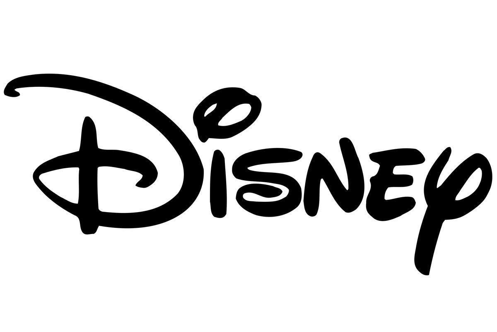

<figure style="display: flex; align-items: center;">
    
    <figcaption>
        <b>Data Scientist - ML Research (Coop) </b> 
        Sept 2024 - Dec 2024
    </figcaption>
</figure>

 - Engineered and deployed ML models to analyze customer churn, identify patterns in interchange fees, payment failures, and chargebacks. Developed causal inference model to assess revenue impact, reducing costs by 10%.
 - Identified and reported the issues in Data modeling and DB design (in Snowflake), optimized the ETL pipeline to further increase the data speed.
 - Developed Executive dashboard on major KPIs dealt with pipeline of 10 Billions rows of data in Payments to create over view of performace of Payment failures, Chargeback fees, Fraud Payments, Refunds, Sales and Profit

<figure style="display: flex; align-items: center;">
    
    <figcaption>
        <b>Software Engineer - Machine Learning Engineer Intern</b> 
        Jun 2024 - Aug 2024
    </figcaption>
</figure>

 - Developed advanced AI Chatbot end-to-end application featuring a Retrieval-Augmented Generation (RAG) model with
support images, ppt format files using OCR (multimodal), embedding using nomic-ai-v1.5 model for Clients
 - Developed & Deployed FAST APIs (in AWS) for clients, to access the E2E product, providing SaaS, API as Service
 - Trained/fine-tuned foundation LLMs (Llama) to enhance the ranking, data retrieval, context rich text generations
 - Designed knowledge graph/semantic chunking, accelerated vector search by 20 sec, retrieval process 20% better accuracy

 - <b> Back end/ML model(RAG/Finetuned LLM) developer of https://traversaal.ai/#contact (API as Service, SaaS) </b>

<figure style="display: flex; align-items: center;">
    
    <figcaption>
        <b>Graduate Teaching / Research Assistant - UCLA</b> 
        Jan 2024 - April 2024
    </figcaption>
</figure>

- Developed statistical software/libraries (in python) for hypothesis testing for Life Science Dept for clinical and research usage [Learn more](https://pypi.org/project/statistics-library/).

<figure style="display: flex; align-items: center;">
    
    <figcaption>
        <b>SDE 2 - Citi, AI & Operations Innovation Lab</b> 
        July 2021 - Sept 2023
    </figcaption>
</figure>

- Innovation Led AIOPS team; Designed ML Models to forecast incidents (RF), automation of incident assignment -
alert/classification (NLP), Batch Alert Automation, Impact Analysis prediction (Regression), Integration of NLP/LLM in chatbots, saving $250K yearly
- Lead Tech Analyst @ Business command center - APAC/EMEA, reducing downtime by 10%, centralised monitoring saving ~$100K.
- Tech Lead HNI/UHNI division at Production Management, enhancing client services, citigold products, incident resolution L1 & L2 
- Implemented Agile, SDLC and  saving 100+ person-hours.
-  Designed new pipeline/infra for MLOPS: Established infrastructure & managed production servers for MLOps operations

<i>Stack: ML/NLP models (TensorFlow, Ski learn), ReactJS, APIs (flask, JWT), SQL, Microservices, ServiceNow, Spark.</i>

**Achievements:** [Citi Awards and Recognitions](https://drive.google.com/file/d/1vz_iv6zuMCkshuL85D0IB-uaBy-M19_y/view?usp=sharing)
- Gold Gratitude Award
- Bronze, Copper Gratitude Award
- Client Obessision Award, Bravo Award

**Achievements:** [Citi Awards and Recognitions](https://drive.google.com/file/d/1vz_iv6zuMCkshuL85D0IB-uaBy-M19_y/view?usp=sharing)
- Gold Gratitude Award
- Bronze, Copper Gratitude Award
- Client Obessision Award, Bravo Award

<figure style="display: flex; align-items: center;">
     
    <figcaption>
        <b>MITACS Globalink Research Intern - Concordia University</b> 
        April 2020 - July 2020
    </figcaption>
</figure>

- Developed supply chain model increasing Walmart Canada's profit by 6%.

<figure style="display: flex; align-items: center;">
    
    <figcaption>
        <b>Research Intern - IIT Madras NCCRD Lab</b>
    </figcaption>
</figure>

- Developed a MATLAB model to perform data analytics (data cleaning, data processing, and data visualization) to detect abnormalities for the development of a new Gasoline Direct Injection engine in a single cylinder in NCCRD Lab.

<figure style="display: flex; align-items: center;">
    <figcaption>
        <b>Machine Learning Intern - Vevolve</b>
    </figcaption>
</figure>

- Collaborated in a team for an R&D project and developed machine learning models (web scrapping, texting mining) in cybersecurity to evaluate the vulnerabilities of the PHP application, generating revenue share of $30K from this project.

